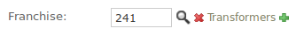

.. django-salmonella documentation master file, created by
   sphinx-quickstart on Sun Sep 11 07:58:02 2011.
   You can adapt this file completely to your liking, but it should at least
   contain the root `toctree` directive.

Welcome to django-salmonella's documentation!
=============================================

A raw_id_fields widget replacement that handles display of an object's string value on change and can be overridden via a template. Here is an example:

The project source is located at Github_, please file bugs and requests there
in the `issue section`_.

Contents:

.. toctree::
   :maxdepth: 1

   installation
   usage

.. _Github: https://github.com/lincolnloop/django-salmonella
.. _issue section: https://github.com/lincolnloop/django-salmonella/issues
